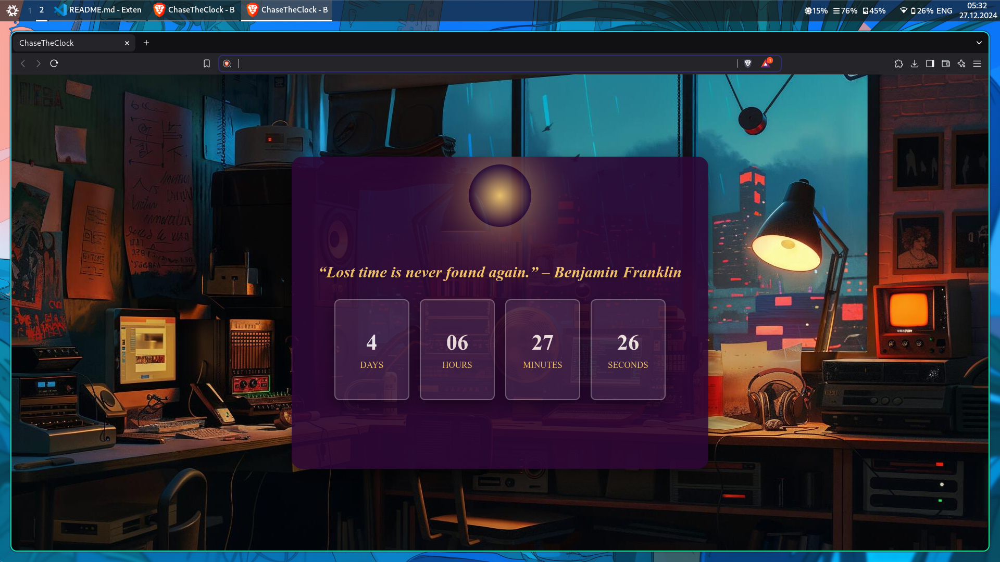

# Countdown Browser Extension

A lightweight browser extension that provides a real-time countdown to the end of the current year, displaying the remaining days, hours, minutes, and seconds. Stay informed about how much time is left in the year with this simple, yet effective tool.



## Features

- **Real-time Countdown**: Continuously updated countdown to the end of the current year, showing days, hours, minutes, and seconds.
- **Precise Time Tracking**: Tracks time with precision, updating every second.
- **Lightweight**: Minimal resource usage, ensuring it doesn't affect browser performance.
- **Customizable**: Easily configurable for different time intervals or appearance preferences.

## Installation

### Chrome / Chromium-based Browsers

1. **Download or Clone the Repository**:
   - Clone the repository using Git:
     ```bash
     git clone https://github.com/yourusername/Countdown-Extension.git
     ```
   - Or download as a ZIP file from the [Releases page](https://github.com/yourusername/Countdown-Extension/releases).

2. **Enable Developer Mode**:
   - Open Chrome and navigate to `chrome://extensions/`.
   - Enable **Developer Mode** by toggling the switch in the top-right corner.

3. **Load the Extension**:
   - Click on **Load unpacked**.
   - Select the folder where the extension files are located (or extract the ZIP if you downloaded it).
   - The extension will now appear in your browser's extension area.

4. **Use the Extension**:
   - Upon installation, the countdown will appear in the top-right corner of your browser and will update in real-time until the end of the year.

### Firefox

1. **Download or Clone the Repository**:
   - Download the extension files or clone the repository using:
     ```bash
     git clone https://github.com/yourusername/Countdown-Extension.git
     ```

2. **Enable Developer Mode**:
   - Open Firefox and navigate to `about:addons`.
   - Enable **Developer Mode** from the Extensions tab.

3. **Install the Extension**:
   - Click on **Load Temporary Add-on**.
   - Select the `manifest.json` file from the extension's directory.

4. **Use the Extension**:
   - The countdown will now appear in the browser, continuously updating until the end of the year.

## Configuration

You can customize the extension by modifying the following files:

- **`manifest.json`**: Adjust browser compatibility, permissions, and extension details.
- **`styles.css`**: Modify the styles to adjust the appearance of the countdown display.
- **`script.js`**: Change the target date for the countdown, or modify the update interval.

## Usage

Once installed, the countdown will start immediately, tracking time until the end of the year. The extension will display in the top-right corner of your browser and update every second.

### Example Countdown Output:

- **Remaining Days**: 12
- **Remaining Hours**: 22
- **Remaining Minutes**: 35
- **Remaining Seconds**: 50

## Contributing

We welcome contributions from the community! If you'd like to contribute, please follow the steps below:

1. **Fork the Repository**: Create a fork of this repository on GitHub.
2. **Make Changes**: Create a new branch and make your changes.
3. **Submit a Pull Request**: Once you're happy with your changes, submit a pull request. Be sure to include a clear description of what your changes do.

### Code Style

- Follow **standard JavaScript** and **CSS** best practices.
- Ensure your code is well-commented and documented.
- Keep commits clear and concise, following a logical progression.

## License

This project is licensed under the **MIT License**. See the [LICENSE](LICENSE) file for details.

## Roadmap

- [x] Initial release
- [ ] Add feature for custom target dates (e.g., event countdown)
- [ ] Optimize for mobile browsers

## Credits

- **Creator**: [Firozkhan](https://x.com/firozkhan_4)
- **Contributors**: Thanks to all who have contributed to the development and improvement of this project.

## Support

If you have any questions or run into issues, feel free to [open an issue](https://github.com/yourusername/Countdown-Extension/issues).

---

> **Note**: This is a simple tool created for fun and learning purposes. It is not intended for production environments but provides a useful starting point for browser extension development.

